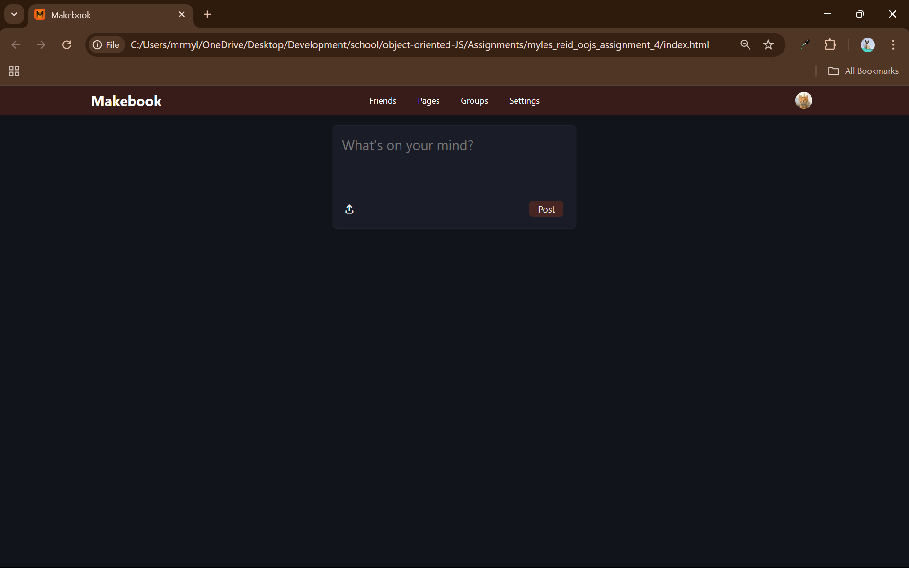

# Mock Facebook (Makebook)
An attempt at a social media sharing platform.

Users have the ability to 'share' text posts and images, while their 'user icon' will display some of their info.

The user currently has been hard coded and is not changeable currently via the interface on the page

---

## Features

- Posts that mimic a social media page
- Ability to upload images
- A pop-up modal that shows only when the user icon is clicked

---

## Lessons Learned

The couple of things that I learned was really how grid works properly. I managed to make it and understand how it was doing what it does. I also learnt how the input type=file works and how to get the information that I require from it.

---

## Screenshots

---

  
  
   

